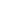

  
  <h1 align="right">SawedoffShot's Gun_Misc</h1>

  
  

 - 自 20240718 
 - 版本: 1.0.1.3 (支持 Rimworld 1.5/1.4)

# 描述

 一个 100% XML 的 Rimworld Mod，旨在添加一些可能适合现实生活和 Vanilla/CE 游戏环境的新武器，“古代（21 世纪）”时代的武器最多。
 本Mod具体内容的"关键词"：
  “灵活“（减少武器冷却时间和瞄准时间) 或 ”廉价/临时用“ 或 ”反蜈蚣”

 "哈，看看咱今个都找到啥?” “就一堆古代的破铜烂铁?" "你再看看"    
 ~~"每个武器都有特别之处，每个都有他们独门Def，数据的平衡性更是技惊四座，秘密特性更是给你意外的惊喜呀"~~
 
# 兼容性:
 游戏中途加入-安全
 原版Core兼容
 
 ==**!!CombatExtended(CE) Compatible/CE兼容!!**==   

 CharacterEditor(CE) Compatible   
 CheatEngine(CE) may Compatible   

# 特性：

 #### Vanilla，但有 CE 补丁：
 - RPG-76： 一种轻型火箭发射器（单次使用，150%/300RHA 穿透力，反蜈蚣或其他钢铁巨虫，但爆炸半径只有 0.8）（比 M72LAW 便宜）
 - 电荷投枪 更致命的电荷标枪变体，单次使用，85%/100mmRHA穿透力（反蜈蚣或其他钢铁巨虫）
 - PirateGun: 小型 M79 榴弹发射器（在 原版 中可隔墙发射）（在 战斗扩展或 vanillaexpanded 下可单手持握）。

 - 20mm自动电荷冲击炮塔：使用20x105mm弹药的电荷炮塔（80%穿透力，反蜈蚣或其他钢铁虫）（在原版中使用塑钢重新装填）（如果在战斗扩展版中使用浓缩弹药，则穿透力为80mm RHA）（在CE版中可切换射击/瞄准模式）

 - 简易截短霰弹枪： 简单易做的霰弹枪（12口径）。在CE版中，也可使用 BlackGunPowder 弹药(CE自带的”BlackGunPowder“科技)。
 - FGC-9：非常简单易做的3d打印的9mm自动手枪。

 - 电磁脉冲发生器： 一种可发射电磁脉冲射流的个人远程武器(定身机械族)，也可在近战中造成电磁脉冲效果。(比 EMP 手榴弹更精准）

 - ~~（已淘汰）XM556：作为5.56 毫米口径速射机枪的变体（比原版的速射机枪更精确。 在原版中，一枪只能打出 20 发子弹，而不是 25 发（削弱了近距离的 DPS）~~

 #### CE独占：
 - FNFAL + M203：一款著名步枪，配备 40x46 毫米的下挂榴弹发射器
 - 带枪膛适配器的邮车枪(就是那种淘金热时期常见的滑膛霰弹枪) (可使用各种低口径弹药：12Gauge、16Ga、20Ga、.410Bore、.22LR)
 - 带枪膛适配器的截短霰弹枪 (可使用各种小口径弹药：12 毫米、16 毫米、20 毫米、.410Bore、.22LR)

 - Since 20240718
 - Version: 1.0.1.3 (Rimworld 1.5/1.4 support)

### 物品数据:

 BasicStats:
  Vanilla:
	
	Gun
	
	Dmg
	
	Range
	
	Burst
	
	Accuracy Touch
	
	Accuracy Short
	
	Accuracy Medium
	
	Accuracy Long
	

  CE:
    Gun
  
    Dmg
  
    Range
  
    Burst

    AmmoSet
  
    ...
  
  
 
# Notes:
 作者玩CE玩的，可能不够熟悉原版环境

# Languages:
 - English
 - ChineseSimplified
 - ChineseTraditional

# FAQ:
 Q1: CE compatible?/兼容CE吗?
 A1: CE compatible./兼容CE ，而且一些物品是CE版独有的(也许作者以后会继续更新相关的物品)

 Q2: 包括但不限于以下的贴图方面的问题: "贴图风格不统一"， "为啥直接把原版的机械族电荷炮台的贴图扒过来用?" , 等等...
 A2: 作者以后也许会优化的。 但现在，作者狠不得把114个小时掰成514个小时来用
 
 Q3: 为何 电荷投枪(charge javelin)/RPG-76 的合成配方未翻译为中文?
 A3: 已翻译，但在游戏中由于未知原因并未显示，作者表示暂时不知道如何修复。

# 已知问题:
 暂时未知(截至 20240809)

# 更新日志:
 - 20240822 - 第一次github预发布 (CE兼容进行中)
 - 20240826 - 第一次github发布 (CE兼容基本完成)
 
# 作者的未来计划:
 (WIP) SawedoffShotgun's Mechanoid_Combat

# 致谢名单:
 - **!! 感谢所有社区贡献者与社区享受者，和你 - 鼓励支持与bug反馈 !!**
 - **!! Tonas ("Combat Extended Launcher"的作者) - 参考了下他/她写的 "BalanceNotes.txt"的数据， 当然也有启发到鄙人 !!**

# 关于作者:
 - SawedoffShotgun

# License:
 (占位符)

# 联系方式: (如遇问题，请联系作者电子邮箱)
 联系方式:  
  youngturksfree@outlook.com (主要)

 Github: https://github.com/AlohaOe114
 Ludeon: (占位符)

# 另见:(其他作品)
 (占位符)

# 如果你喜欢我的作品
 ~~Ko-fi me if you like~~    
 ~~Patreon~~

 暂不接委托

